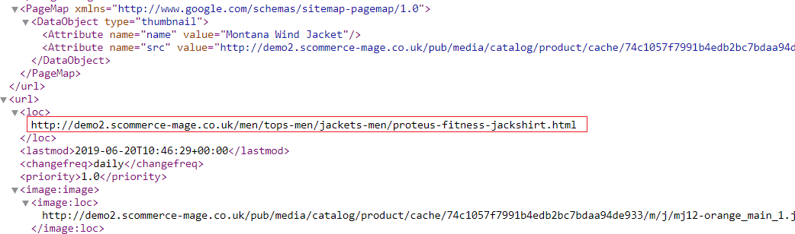

# Magento 2 Google Site Map Exclusion

### <mark style="color:blue;">Installation and User Guide for Magento 2 Google Sitemap Exclusion</mark>&#x20;

**Table of Contents**

1. __[_Installation_ ](magento-2-google-site-map-exclusion.md#\_toc\_250004)__
   * _Installation via app/code_
   * _Installation via Composer_
2. [_Configuration Settings for SEO Base_ ](magento-2-google-site-map-exclusion.md#\_toc\_250003)__
   * _General Settings_&#x20;
3. __[_Configuration Settings for SEO Sitemap Exclusion_ ](magento-2-google-site-map-exclusion.md#\_toc\_250001)__
   * _General Settings_&#x20;
   * _Exclude Categories from Sitemap_&#x20;
   * _Exclude Products from Sitemap_&#x20;
   * _Exclude CMS Pages from Sitemap_&#x20;
   * _How to Generate Sitemap_&#x20;
   * _Add new Sitemap_&#x20;
   * _Magento Out of the Box Functionality to set the Category Path_&#x20;
4. __[_Google Sitemap XML_ ](magento-2-google-site-map-exclusion.md#google-sitemap-xml)__
   * _Product Link in Sitemap XML_&#x20;
   * _Category Link in Sitemap XML_&#x20;
   * _CMS Pages Link in Sitemap XML_&#x20;
5. __[_Set Path Priority_](magento-2-google-site-map-exclusion.md#set-path-priority)__
6. __[_Override Canonical URL_](magento-2-google-site-map-exclusion.md#override-canonical-url)
   * _Category Page_
   * _Product Page_
   * _CMS Page_
7. __[_Set Primary Categories_](magento-2-google-site-map-exclusion.md#set-primary-categories)__

### <mark style="color:blue;">Installation</mark> <a href="#_toc_250004" id="_toc_250004"></a>

* <mark style="color:orange;">**Installation via app/code:**</mark>** ** Upload the content of the module to your root folder. This will not overwrite the existing Magento folder or files, only the new contents will be added. After the successful upload of the package, run below commands on Magento 2 root directory.

```
php bin/magento setup:upgrade
php bin/magento setup:di:compile
php bin/magento setup:static-content:deploy
```

* <mark style="color:orange;">**Installation via Composer:**</mark> Please follow the guide provided in the below link to complete the installation via composer.


[installation-via-composer.md](../installation-via-composer.md)


### <mark style="color:blue;">Configuration Settings for SEO Base</mark> <a href="#_toc_250003" id="_toc_250003"></a>

Go to _Admin > Stores > Configuration > Scommerce Configuration > SEO Base_

#### <mark style="color:orange;">General Settings</mark> <a href="#_toc_250030" id="_toc_250030"></a>

* **Enabled -** Select “Yes” or “No” to enable or disable the module.
* **License Key –** Please add the license for the extension which is provided in the order confirmation email. Please note license keys are site URL specific. If you require license keys are dev/staging sites then please email us at [core@scommerce-mage.com](file:///C:/Users/jatin/OneDrive/Documents/core%40scommerce-mage.com)

.png>)

### <mark style="color:blue;">Configuration Settings for SEO Sitemap Exclusion</mark> <a href="#_toc_250029" id="_toc_250029"></a>

Go to _Admin > Stores > Configuration > Scommerce Configuration > SEO Sitemap_

#### <mark style="color:orange;">General Settings</mark> <a href="#_toc_250028" id="_toc_250028"></a>

* **Enable -** Select “Yes” or “No” to enable or disable the module.


* <mark style="color:orange;">**Exclude Categories from Sitemap –**</mark> To include or exclude categories, go to _Admin > Catalog > Manage Categories > Select category (you want to exclude from site map) > General > Exclude from Sitemap: Set to “Yes/No”_

>)

* <mark style="color:orange;">**Exclude Products from Sitemap –**</mark>** ** To exclude products from sitemap, go to _Admin > Catalog > Manage Products > Select product (you want to exclude from sitemap) > General > Exclude from Sitemap: Set to ”Yes/No”._

>)

* <mark style="color:orange;">**Exclude CMS Pages from Sitemap –**</mark> To exclude CMS pages from sitemap, go to _Admin > CMS > Pages > Select CMS Page (you want to exclude from site map) > General > Exclude from Sitemap: Set to “Yes/No”_

>)

* <mark style="color:orange;">**How to Generate Sitemap –**</mark>** ** To generate the site map from the admin panel go to, _Admin > Marketing > Sitemap > Click ''Generate Sitemap''._

>)

* <mark style="color:orange;">**Add new Sitemap -**</mark> You can create new site map from, _Admin > Marketing > Sitemap > Click ''Add Sitemap''_, it redirects to New Site Map page and by providing all the required details you can create Site Map.

>)

* <mark style="color:orange;">**Magento Out of the Box Functionality to set the Category Path -**</mark>** ** To include category path in product URLs in sitemap.xml, go to _Admin > System > Configuration > Catalog > Catalog > Search Engine Optimizations > Use Categories Path for Product URLs: Set to "yes"._

>)

### <mark style="color:blue;">**Set Path Priority**</mark>

We have a priority system in place for the URL path that is to be included in the sitemap. The URL path is picked based on the below priority system:-

* **Override canonical URL:-** It is of highest priority. If this is set for any product, category or CMS page then canonical URL path will be picked in the sitemap.


* **Set Primary Category:-** It is secondest highest priority. If override canonical URL is not set then the primary category path set is picked in the sitemap.


* **Default Path:-** if neither override canonical URL nor Set primary Category is set then the default path of the product, category or CMS page is picked to be included in the sitemap.


### <mark style="color:blue;">**Override Canonical URL**</mark>

You can set the override canonical URL for any product, category or CMS page. The steps to setup override canonical URL is provided as below:-

#### <mark style="color:orange;">Category Page</mark>

Go to Admin>Catalog>Categories and select any category. Scroll down to find the tab "Search Engine Optimization". Enter the URL path in the "Override Canonical URL" section.&#x20;


#### <mark style="color:orange;">Product Page</mark>

Go to Admin>Catalog>products and select any product and click edit. Scroll down to find the tab "Search Engine Optimization". Enter the URL path in the "Override Canonical URL" section.&#x20;


#### <mark style="color:orange;">CMS Page</mark>

Go to Admin>Content>Pages and select any page. Scroll down to find the tab "Search Engine Optimization". Enter the URL path in the "Override Canonical URL" section.&#x20;


### <mark style="color:blue;">Set Primary Categories</mark>

You can use a script provided with the extension to automatically add primary categories for products. Admin can exclude certain categories from primary category and also prioritise one category over the other to be picked as the primary category.

Go to Admin>Catalog>Categories select a category then scroll down to find the option "Primary Category Settings". Here click on "Exclude From Primary Category" to exclude this category from primary category or enter the priority 0 being the highes. The highest priority category will be picked first for the primary category.

 (1).png>)

To automatically assingn primary category for all products run the command given below by going into the root directory of your store.

```
scommerce:seo-base:set-primary-category
```

_<mark style="color:red;">**N.B -**</mark>_ _<mark style="color:red;">If you are using older version then run the script provided in the extension folder at the path Data/SetPrimaryCategoryM2.php from ssh</mark>_

### <mark style="color:blue;">**Google Sitemap XML**</mark>&#x20;

Google site map shows all the included Products, Categories**,** and CMS Pages links in the sitemap.xml.

* <mark style="color:orange;">**Category Link in Sitemap XML -**</mark> You can see the category link in the Google Sitemap XML.

>)

* <mark style="color:orange;">**CMS Pages Link in Sitemap XML -**</mark>** ** In the below screen grab you can see the about-us page link in the Google Sitemap XML.

>)

* <mark style="color:orange;">**Product Link in Sitemap XML -**</mark>** ** You can see the product link in the Google Sitemap XML.



<mark style="color:blue;"></mark>

If you have a question related to this extension please check out our [**FAQ section**](https://www.scommerce-mage.com/magento-2-google-sitemap-exclusion.html#faq) first. If you can't find the answer you are looking for then please contact [**core@scommerce-mage.com**](mailto:core@scommerce-mage.com)**.**
