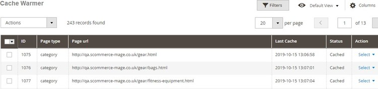

# Magento 2 Full Page Cache Warmer

### <mark style="color:blue;">Installation and User Guide for Magento 2 Full Page Cache Warmer Extension</mark>

**Table Of Contents**

1. [_Installation_ ](magento-2-full-page-cache-warmer.md#\_toc\_250008)__
   * _Installation via app/code_
   * _Installation via Composer_&#x20;
2. __[_Configuration Settings for Optimiser Base_ ](magento-2-full-page-cache-warmer.md#\_toc\_250007)__
   * _General Settings_&#x20;
3. [_Configuration Settings for Full Page Cache Warmer_ ](magento-2-full-page-cache-warmer.md#\_toc\_250005)__
   * _General Settings_&#x20;
   * _Cron Settings_&#x20;
4. [_Cache Warmer Grid_ ](magento-2-full-page-cache-warmer.md#\_toc\_250002)__
   * _Regenerate_&#x20;
5. __[_Console Commands_ ](magento-2-full-page-cache-warmer.md#\_toc\_250001)__
   * _Category Page_&#x20;
   * _Product Page_&#x20;
   * _CMS Page_&#x20;
6. [_Front-end Site View_ ](magento-2-full-page-cache-warmer.md#\_toc\_250000)__
   * _Cache Hit for the Category Page After the Execution of Category Page Command_&#x20;
   * _Cache Miss for the Category Page_&#x20;

### <mark style="color:blue;">Installation</mark> <a href="#_toc_250008" id="_toc_250008"></a>

* <mark style="color:orange;">**Installation via app/code:**</mark>** ** Upload the content of the module to your root folder. This will not overwrite the existing Magento folder or files, only the new contents will be added. After the successful upload of the package, run below commands on Magento 2 root directory.

```
php bin/magento setup:upgrade
php bin/magento setup:di:compile
php bin/magento setup:static-content:deploy
```

* <mark style="color:orange;">**Installation via Composer:**</mark> Please follow the guide provided in the below link to complete the installation via composer.


[installation-via-composer.md](../installation-via-composer.md)


### <mark style="color:blue;">Configuration Settings for Optimiser Base</mark> <a href="#_toc_250007" id="_toc_250007"></a>

Go to **Admin > Stores > Configuration > Scommerce Configuration > Optimiser Base**

#### <mark style="color:orange;">General Settings</mark> <a href="#_toc_250006" id="_toc_250006"></a>

* **Enabled –** Select “Yes” or “No” to enable or disable the module.
* **License Key –** Please add the license for the extension which is provided in the order confirmation email. Please note license keys are site URL specific. If you require license keys for dev/staging sites then please email us at [core@scommerce-mage.com](mailto:core@scommerce-mage.com)


### <mark style="color:blue;">Configuration Settings for Full Page Cache Warmer</mark> <a href="#_toc_250005" id="_toc_250005"></a>

Go to **Admin > Stores > Configuration > Scommerce Configuration > Cache Warmer**

#### <mark style="color:orange;">General Settings</mark> <a href="#_toc_250004" id="_toc_250004"></a>

* **Enabled -** Select “Yes” or “No” to enable or disable the module.
* **Regenerate cache after page update -** Please select "Yes" or "No" to regenerate cache for updated page.
* **Select Pages -** Please select the page(s) from the multi-select option . This will regenerate the cache selected page(s) on page update.
* **Can Regenerate Cache Manually -** Please select " Yes" or "No". If set to "Yes" then you can regenerate cache manually from cache warmer grid.
* **Generate Log -** Select "Yes" to generate the log.


#### <mark style="color:orange;">Cron Settings</mark> <a href="#_toc_250003" id="_toc_250003"></a>

* **Cache Cron Schedule -** Schedule cron job to regenerate the cache for all non cached page(s).
* **Delay in Request -** Please define delay in request in seconds. This setting will apply a delay in seconds between the concurrent request.
* **Number of Concurrent Regeneration request -** Please define the number of concurrent request.


### <mark style="color:blue;">Cache Warmer Grid</mark> <a href="#_toc_250002" id="_toc_250002"></a>

When you enable the module and set **General Settings > Can Regenerate Cache Manually >** to **"Yes"** then it adds an additional option "Regenerate" under the "**Actions > Select**" drop-down at **Admin > System > Cache Warmer > Actions.** This grid will have Id, Page Type - (Home, Product, Category, CMS), Page URL, Last Cache - (Date, Time ), Status - (Cached/Un-cached), and Action- (Regenerate, Delete).



* <mark style="color:orange;">**Regenerate -**</mark>** ** It regenerates cache manually for Category/Product/CMS page(s). By clicking "Regenerate" action you can regenerate cache manually for a specific URL.

>)

### <mark style="color:blue;">Console Commands</mark> <a href="#_toc_250001" id="_toc_250001"></a>

You can regenerate cache for Product/Category/CMS page(s) by running the following console commands:-

* <mark style="color:orange;">**Category Page -**</mark>** ** To regenerate cache for the category page, execute the below command.

&#x20;**`scommerce:cachewarmer:category`**

>)

* <mark style="color:orange;">**Product Page -**</mark>** ** To regenerate cache for the product page(s), execute the below command.

&#x20;** `scommerce:cachewarmer:product`**

>)

* <mark style="color:orange;">**CMS Page -**</mark>** ** To regenerate cache for CMS page, run the below command.

&#x20;**`scommerce:cachewarmer:cmspage`**

>)

### <mark style="color:blue;">Front-end Site View</mark> <a href="#_toc_250000" id="_toc_250000"></a>

* <mark style="color:orange;">**Cache Hit for the Category Page After the Execution of Category Page Command -**</mark>** ** When you execute the command for category page then it regenerates the cache and on the front-end you check the status "Hit" or "Miss" using browser tool (Inspect element) at **Network > Select Page URL > Header > X- Magento-Cache-Debug : HIT**

>)

* <mark style="color:orange;">**Cache Miss for the Category Page -**</mark>** ** Flush the cache by executing the command, **c:f** and then check cache using browser tool at, **Network > Select Page URL > Header > X-Magento-Cache-Debug : MISS**

>)

If you have a question related to this extension please check out our [**FAQ Section**](https://www.scommerce-mage.com/magento-2-full-page-cache-warmer.html#faq) **** first. If you can't find the answer you are looking for then please contact [**support@scommerce-mage.com**](mailto:core@scommerce-mage.com)**.**
