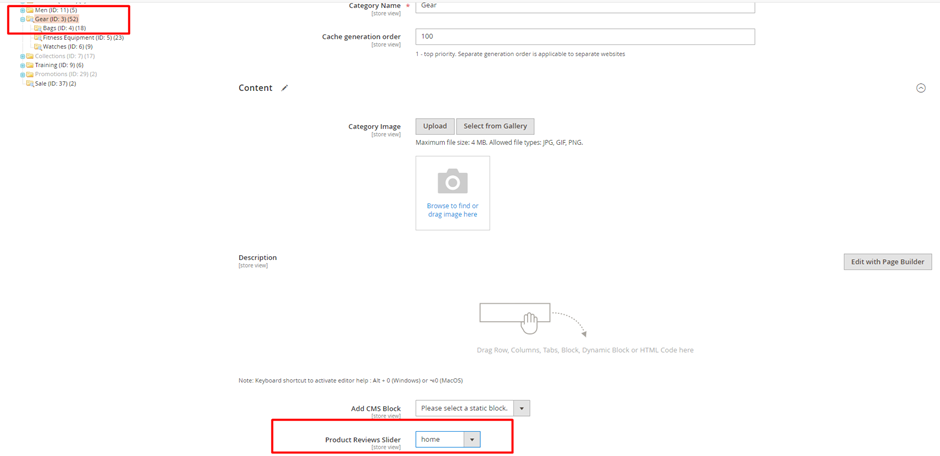

# Magento 2 Product Reviews

### <mark style="color:blue;">Installation and User Guide for Magento 2 Product Reviews</mark>

**Table of Contents**

1. [_Installation_ ](magento-2-product-reviews.md#\_bookmark0)
   * _Installation via app/code_&#x20;
   * _Installation via Composer_
2. [_Configuration Settings for Product Reviews_](magento-2-product-reviews.md#\_bookmark3)
   * _General Settings_&#x20;
3. [_Creating New Review Sliders_](magento-2-product-reviews.md#\_bookmark5)
4. [_A_d](magento-2-product-reviews.md#\_bookmark5)[ding Review Slider](magento-2-product-reviews.md#\_bookmark5)
   * _Category Page_
   * _CMS Pages_
5. [_Front-End View_](magento-2-product-reviews.md#front-end-view)
   * _Email Field in Review Form_
   * _Reviews on CMS Pages_
   * _Reviews on Category Pages_

### <mark style="color:blue;">Installation</mark> <a href="#bookmark0" id="bookmark0"></a>

* <mark style="color:orange;">**Installation via app/code:**</mark> Upload the content of the module to your root folder. This will not overwrite the existing Magento folder or files, only the new contents will be added. After the successful upload of the package, run below commands on Magento 2 root directory.

```
php bin/magento setup:upgrade
php bin/magento setup:di:compile
php bin/magento setup:static-content:deploy
```

* <mark style="color:orange;">**Installation via Composer:**</mark> Please follow the guide provided in the below link to complete the installation via composer.


[installation-via-composer.md](../installation-via-composer.md)


### <mark style="color:blue;">Configuration Settings for Substitute Products</mark> <a href="#bookmark3" id="bookmark3"></a>

Go to **Admin > Stores > Configuration > Scommerce Configuration >Substitute Products**

#### <mark style="color:orange;">General Settings</mark> <a href="#bookmark4" id="bookmark4"></a>

* **Enabled -** Select “Yes” or “No” to enable or disable the module.
* **License Key –**Please add the license for the extension which is provided in the order confirmation email. Please note license keys are site URL specific. If you require license keys for dev/staging sites then please email us at [support@scommerce-mage.com](mailto:support@scommerce-mage.com).
* **Email Field Enabled -**Set "Yes" to enable the email field in the product review form and set "No" to disable the email field.

<figure><figcaption></figcaption></figure>

### <mark style="color:blue;">Creating New Review Sliders</mark> <a href="#bookmark5" id="bookmark5"></a>

* Go to 'Marketing'->'Product Review Slider'
* Click on 'Add New Slider'&#x20;

<figure><figcaption></figcaption></figure>

* In 'slider information' fill the title then go to 'product reviews'. and you will be able to see approved reviews.&#x20;

<figure><figcaption></figcaption></figure>

* Select as many reviews as you want and click on 'Save Slider' or 'Save and Continue Edit'

<figure><figcaption></figcaption></figure>

* You can add this review slider to any category page, CMS page and CMS block

### <mark style="color:blue;">Adding Review Sliders</mark> <a href="#bookmark5" id="bookmark5"></a>

#### <mark style="color:orange;">Category Page</mark> <a href="#bookmark4" id="bookmark4"></a>

To see reviews under category page.&#x20;

* Go to Catalog-> Categories. Select any category.
* Under ‘Content’ group, go to ‘Product Reviews Slider’ and add one of the Review Slider you have created.
* Save and clear the caches.

<figure><figcaption></figcaption></figure>

#### <mark style="color:orange;">CMS Pages</mark> <a href="#bookmark4" id="bookmark4"></a>

To see reviews under CMS page(e.g.->home page)&#x20;

* Go to Content->Pages. Select any one of the pages.
* Select the HTML code and click on edit.

<figure><figcaption></figcaption></figure>

* Click on Insert Widget. Select the Widget type and widget option.

<figure><figcaption></figcaption></figure>

* Save and clear the caches.

_**Note:-** Similary you add product reviews slider in Blocks using widgets._

### <mark style="color:blue;">Front-End View</mark>

#### <mark style="color:orange;">Email Feild in Review Form</mark> <a href="#bookmark4" id="bookmark4"></a>

Once Email field is enabled from the configuration this field is visible in the Product review form:-

<figure><figcaption></figcaption></figure>

#### <mark style="color:orange;">Reviews on CMS Pages</mark> <a href="#bookmark4" id="bookmark4"></a>

We had assigned product reviews slider to the What's New Page the review slider can be seen on the product page.&#x20;

<figure><figcaption></figcaption></figure>

#### <mark style="color:orange;">Reviews on Category Pages</mark> <a href="#bookmark4" id="bookmark4"></a>

Go to the frontend to that category and reviews will be seen at the bottom of the page.

<figure><figcaption></figcaption></figure>

If you have a question related to this extension please check out our **FAQ Section** first. If you can't find the answer you are looking for then please contact [**support@scommerce-mage.com**](mailto:core@scommerce-mage.com)**.**
