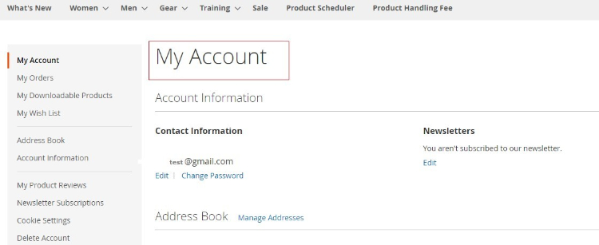

# Magento 2 Social Login

### <mark style="color:blue;">Installation and User Guide for Magento 2 Social Login Extension</mark>

**Table of Contents**

1. [_Installation_ ](magento-2-social-login.md#\_bookmark0)
   * _Installation via app/code_&#x20;
   * _Installation via Composer_
2. [_Configuration Settings for Social Login_ ](magento-2-social-login.md#\_bookmark3)
   * _General Settings_&#x20;
   * _Facebook_&#x20;
   * _Google_&#x20;
   * _Create Facebook App Id_&#x20;
   * _Create Google App Id_&#x20;
3. [_Front-end Site View_ ](magento-2-social-login.md#\_bookmark9)
   * _Social Login Options on the Front-end_&#x20;
   * _Social Login Options on the Sign In Page_&#x20;
   * _Social Login Options on the Registration Page_&#x20;
   * _Social Login Options on the Checkout Page_&#x20;

### <mark style="color:blue;">Installation</mark> <a href="#_bookmark0" id="_bookmark0"></a>

* <mark style="color:orange;">**Installation via app/code:**</mark> Upload the content of the module to your root folder. This will not overwrite the existing Magento folder or files, only the new contents will be added. After the successful upload of the package, run below commands on Magento 2 root directory.

```
php bin/magento setup:upgrade
php bin/magento setup:di:compile
php bin/magento setup:static-content:deploy
```

* <mark style="color:orange;">**Installation via Composer:**</mark> Please follow the guide provided in the below link to complete the installation via composer.


[installation-via-composer.md](../installation-via-composer.md)


### <mark style="color:blue;">Configuration Settings for Social Login</mark> <a href="#_bookmark3" id="_bookmark3"></a>

Go to **Admin > Stores > Configuration > Scommerce Configuration > Social Login**

#### <mark style="color:orange;">General Settings</mark> <a href="#_bookmark4" id="_bookmark4"></a>

* **Enabled –** Select “Yes” or “No” to enable or disable the module.
* **License Key –** Please add the license for the extension which is provided in the order confirmation email. Please note license keys are site URL specific. If you require license keys for dev/staging sites then please email us at [core@scommerce-mage.com](mailto:core@scommerce-mage.com)
* **Send Password to Customers –** Set yes or no for send password to customers.
* **Show Social Login Buttons on –** Select where all you want to show the social login options.
* **Use Popup Login –** Set yes or no to enable/disable the popup.
* **Popup Links Selector –** Comma-seperated. Compatible: Etheme\_YourStore \[ dropdown-menu.dropdown-menu—xs-full ]
* **Popup effect –** Select pop up appearing effect.
* **Style Management –** Select color for the popup.
* **Custom CSS –** Enter your Custom CSS.


#### <mark style="color:orange;">Facebook</mark> <a href="#_bookmark5" id="_bookmark5"></a>

* **Enabled –** Select “Yes” or “No” to enable or disable the module.
* **Facebook App Id –** Enter your Facebook App Id. To create App Id, check [Facebook Developer](https://developers.facebook.com/apps).
* **Facebook App Secret –** Enter your Facebook App secret.
* **Valid OAuth redirect URLs –** Enter the redirect URLs.
* **Sort Order –** Enter the sort order for display.


#### <mark style="color:orange;">Google</mark> <a href="#_bookmark6" id="_bookmark6"></a>

* **Enabled –** Select “Yes” or “No” to enable or disable the module.
* **Client Id –** Enter your Google Client Id. To create Client Id, check [Google App](https://cloud.google.com/console/project).
* **Client Secret –** Enter your Secret Id.
* **Redirect Urls –** Enter the redirect urls.
* **Sort Order –** Sort order for display.


* **Create Facebook App Id -** To create Faceook app Id go to [**Facebook Developers**](https://developers.facebook.com/apps), login as a developer and choose “Create App” in the “My Apps” drop-down.


Specify the “Display Name” and “Contact Email” for your app. After that, click the “Create App ID”.


Go to the **Settings > Basic tab** to configure your app. The App ID and App Secret will be generated automatically. Fill the App Domains field and choose your app Category.


Click on the “Add Platform” button to choose the platform for your social apps.


After clicking on the Add Platform button you will see the grid with various platform types. Please select Web.


After specifying the platform type, insert your website URL and click on the “Save Changes” button.


Enable the “Client OAuth Login” from **Facebook Login > Settings** and provide the “Valid OAuth Redirect URLs”.


To apply the configuration, change the Status from “In development” to “Live”.


Insert your Facebook App Id and Secret Key in Facebook settings and Save the configuration.


<mark style="color:orange;">**Create Google App Id –**</mark> To create Google App go to [**Google App**.](https://cloud.google.com/console/project) Click on the “CREATE PROJECT” button and configure your app settings.


Specify your “Project name”, the project ID will be generated automatically.


Go to the Credentials tab and create a client ID to integrate your website with Google.


Insert your website URL in the required field. In the field “Authorized Redirect URLs” add redirect website URL. Then, press the Create button.


Please copy the Client ID and Client Secret. Insert your API KEY (Client ID) and API Secret (Client Secret) in the appropriate fields in the backend Google settings and save the configuration.


### <mark style="color:blue;">Front-end Site View</mark> <a href="#_bookmark9" id="_bookmark9"></a>

* <mark style="color:orange;">**Social Login Options on the Front-end -**</mark> When you enable the Facebook and Google logins and select the pages to show social login pop ups from **Admin > Stores > Configuration > Scommerce Configuration > Social Login > "Show Social Login Buttons On"** - Customer Login Page/ Customer Create Page/Social Popup Login/Shopping Cart/Checkout, then it shows social login options on the respective pages.
* <mark style="color:orange;">**Social Login Options on the Sign In Page –**</mark> When you click on “Sign in with Google” then it opens Sign in with Google page.


After successful login, it redirects to My Account page.



* <mark style="color:orange;">**Social Login Options on the Registration Page**</mark>


* <mark style="color:orange;">**Social Login Options on the Checkout Page**</mark>


If you have a question related to this extension please check out our [**FAQ Section**](https://www.scommerce-mage.com/magento-2-social-login.html#faq) first. If you can't find the answer you are looking for then please contact [**support@scommerce-mage.com**](mailto:core@scommerce-mage.com)**.**
