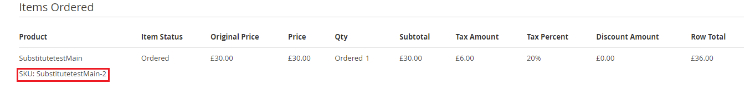
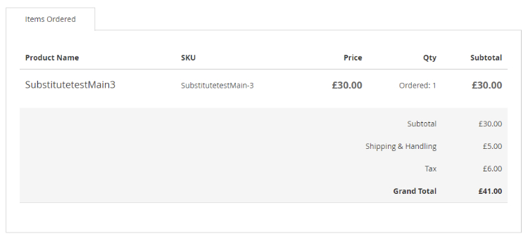

# Magento 2 Substitute Products


### <mark style="color:blue;">Installation and User Guide for Magento 2 Substitute Products Extension</mark>

**Table of Contents**

1. [_Installation_ ](magento-2-substitute-products.md#\_bookmark0)
   * _Installation via app/code_&#x20;
   * _Installation via Composer_
2. [_Configuration Settings for S_ubstitute Products](magento-2-substitute-products.md#\_bookmark3)
   * _General Settings_&#x20;
3. [_A_ssigning Substitute Products](magento-2-substitute-products.md#\_bookmark5)
   * _Add Substitute Products_
   * _Order Placed with Substitute Product_
4. [_Front-End View_](magento-2-substitute-products.md#front-end-view)

### <mark style="color:blue;">Installation</mark> <a href="#bookmark0" id="bookmark0"></a>

* <mark style="color:orange;">**Installation via app/code:**</mark> Upload the content of the module to your root folder. This will not overwrite the existing Magento folder or files, only the new contents will be added. After the successful upload of the package, run below commands on Magento 2 root directory.

```
php bin/magento setup:upgrade
php bin/magento setup:di:compile
php bin/magento setup:static-content:deploy
```

* <mark style="color:orange;">**Installation via Composer:**</mark> Please follow the guide provided in the below link to complete the installation via composer.


[installation-via-composer.md](../installation-via-composer.md)


### <mark style="color:blue;">Configuration Settings for Substitute Products</mark> <a href="#bookmark3" id="bookmark3"></a>

Go to **Admin > Stores > Configuration > Scommerce Configuration >Substitute Products**

#### <mark style="color:orange;">General Settings</mark> <a href="#bookmark4" id="bookmark4"></a>

* **Enabled -** Select “Yes” or “No” to enable or disable the module.
* **License Key –**Please add the license for the extension which is provided in the order confirmation email. Please note license keys are site URL specific. If you require license keys for dev/staging sites then please email us at [core@scommerce-mage.com.](file:///C:/Users/KoshleshDange/Downloads/Microsoft.SkypeApp\_kzf8qxf38zg5c!App/All/core%40scommerce-mage.com)


### <mark style="color:blue;">Assigning Substitute Products</mark> <a href="#bookmark5" id="bookmark5"></a>

The substitute product should have exactly same configurations as the main product only the SKU will be different. You can create a duplicate product of the main product while creating a new substitute product.&#x20;

#### <mark style="color:orange;">Add Substitute Products</mark>

Go to **Admin>Catalog>Products**, navigate to your product from the list and click on Edit from the action column. Scroll down to find the **Subsitute Products** tab. Please refer to the image below:-

 (1) (1) (1) (1) (1) (1) (1) (1).png>)

Click on **Enabled** to enable the substitute products for this main product. Add the SKU of the product that you want to add as a substitute of this product and add the priority. In case of multiple substitute products you can set the priortiy highest being 0 so that whenever products are out of stock, upon order placement the SKU will be chosen based on the priority set.&#x20;

Also, as long as the substitute products attached to the main product are not out of stock the main product on the frontend will never show out of stock.&#x20;

You can add substitute products for several products such as Simple, Configurable, Bundled etc.&#x20;

#### <mark style="color:orange;">Order Placed With Subsitute Products</mark>

Suppose our main product is out of stock then when a customer visits the storefront they will always see the product available as long as the substiute product assigned is in stock. Orders placed with the main product will be fullfilled with the subsitute product. Place an order with the main product then go to **Admin>Sales>Orders**, and select your order. We can see the substitute product SKU in the order detail since main product is out of stock.&#x20;



### <mark style="color:blue;">Front-End View</mark>

We place the order with the main product having sku SubstitutetestMain but since this product is out of stock the order should be fullfilled with the substitute product assigned. Now upon placing the order go to **My Account>My Orders** and view the order, you will be able to see that the order is placed with the substiute product.&#x20;



If you have a question related to this extension please check out our **FAQ Section** first. If you can't find the answer you are looking for then please contact [**support@scommerce-mage.com**](mailto:core@scommerce-mage.com)**.**
