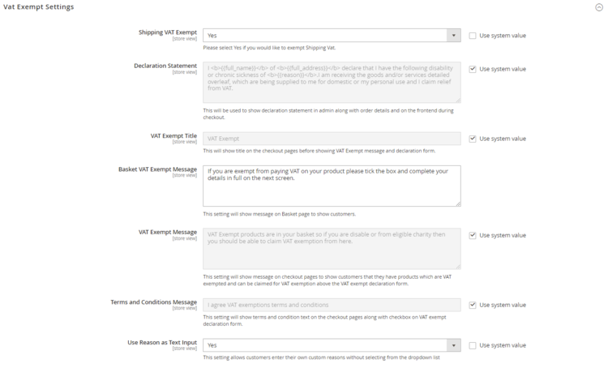

# Magento 2 VAT Exemption

### <mark style="color:blue;">Installation and User Guide for Magento 2 Vat Exemption Extension</mark>

**Table of Contents**

1. __[_Installation_ ](magento-2-vat-exemption.md#\_bookmark0)__
   * _Installation via app/code_&#x20;
   * _Installation via Composer_
2. __[_Configuration Settings for Vat Exemption_ ](magento-2-vat-exemption.md#\_bookmark3)__
   * _General Settings_&#x20;
   * _Vat Exempt Settings_&#x20;
3. __[_VAT Exempt - Reasons_ ](magento-2-vat-exemption.md#\_bookmark6)__
   * _Create New Reason_&#x20;
4. __[_Admin Order View Page_ ](magento-2-vat-exemption.md#\_bookmark8)__
   * _Declaration Statement on Order View Page_&#x20;
   * _VAT Exemption Details on Order View Page_&#x20;
   * _VAT Exemption Option for Admin Orders_&#x20;
5. __[_Enable VAT Exemption for Products_ ](magento-2-vat-exemption.md#\_bookmark11)__
   * _Include or Exclude Product_&#x20;
6. __[_Front-end Site View_ ](magento-2-vat-exemption.md#\_bookmark13)__
   * _VAT Exempt Form on the Cart Page_&#x20;
   * _VAT Exempt Message on the Cart Page_&#x20;
   * _VAT Exempt Option on the Checkout Page_&#x20;
   * _VAT Exempt Discount_&#x20;
   * _Shipping VAT…_&#x20;
   * _VAT Exempt Discount on the Front-end_&#x20;
   * _VAT Exempt Declaration Statement on the Front-end_&#x20;

### <mark style="color:blue;">Installation</mark> <a href="#_bookmark0" id="_bookmark0"></a>

* <mark style="color:orange;">**Installation via app/code:**</mark>** ** Upload the content of the module to your root folder. This will not overwrite the existing Magento folder or files, only the new contents will be added. After the successful upload of the package, run below commands on Magento 2 root directory.

```
php bin/magento setup:upgrade
php bin/magento setup:di:compile
php bin/magento setup:static-content:deploy
```

* <mark style="color:orange;">**Installation via Composer:**</mark> Please follow the guide provided in the below link to complete the installation via composer.


[installation-via-composer.md](../installation-via-composer.md)


### <mark style="color:blue;">Configuration Settings for Vat Exemption</mark> <a href="#_bookmark3" id="_bookmark3"></a>

Go to **Admin > Stores > Configuration > Scommerce Configuration > Vat Exempt Settings**

#### <mark style="color:orange;">General Settings</mark>

* **Enabled -** Select “Yes” or “No” to enable or disable the module.
* **License Key -** Please add the license for the extension which is provided in the order confirmation email. Please note license keys are site URL specific. If you require license keys for dev/staging sites then please email us at [core@scommerce-mage.com.](mailto:core@scommerce-mage.com)


#### <mark style="color:orange;">Vat Exempt Settings</mark> <a href="#_bookmark5" id="_bookmark5"></a>

* **Shipping VAT Exempt -** Please Select "Yes/No" to include or exclude shipping from VAT exemption (Default - No).
* **Declaration Statement -** Please provide declaration statement. This will be shown in admin along with order details and on the frontend checkout page.
* **VAT Exempt Title -** Please provide title. This will be shown on the checkout page before VAT Exempt message and declaration form (Default - VAT Exempt).
* **Basket VAT Exempt Message -** Please add VAT exempt message. This will be shown on the cart/basket page.
* **VAT Exempt Message -** Please provide VAT Exempt message. This will be shown on the checkout page under VAT exempt section to users who are applying for VAT exemption. **(Default - VAT Exempt products are in your basket so if you are disable or from eligible charity then you should be able to claim VAT exemption from here).**
* **Terms and Condition Message -** Please provide terms and conditions message. This will be shown on the checkout pages along with checkbox on VAT exempt declaration form.
* **Use Reason as Text Input-** Set "Yes" to allow customers to enter their own custom reasons without selecting from the dropdown list



* **Show VAT Exempt -** Set "Yes" to show vat exempt form on the checkout otherwise it will be hidden.
* **Next button text-** Use this setting to change text for “Next” button on the checkout page.
* **Apply button text-** Use this setting to change text for “Apply VAT exempt” button on the checkout page.
* **Cancel button text-** SUse this setting to change text for “Cancel VAT exempt” button on the checkout page.
* **More info area-** Set "Yes" to add more information about VAT exemption for your customers

<figure><figcaption></figcaption></figure>

### <mark style="color:blue;">VAT Exempt - Reasons</mark> <a href="#_bookmark6" id="_bookmark6"></a>

You can create and manage reasons for VAT Exemption from the backend, **Admin > VAT Exempt > Reasons > Vat Exempt Reasons**. This grid will have columns like, ID, Reason, Status, Action, along with create new button to add new reason.


* <mark style="color:orange;">**Create New Reason -**</mark>** ** To create new reason from the backend, go to **Admin > VAT Exempt > Reasons >** click **"Create New"** and set below configuration.
* Reason : Add the reason title
* Sort Order: Enter sort order
* Status: Select reason status

### <mark style="color:blue;">Admin Order View Page</mark> <a href="#_bookmark8" id="_bookmark8"></a>

* <mark style="color:orange;">**Declaration Statement on Order View Page -**</mark>** ** You can see the declaration statement and VAT exemption details on the order view page at, **Sales > Orders > Select Order > View**.


* <mark style="color:orange;">**VAT Exemption Details on Order View Page -**</mark>** ** In the screen grab you can see the Vat exempted amount under **''Order Totals’’ section**.

>)

* <mark style="color:orange;">**VAT Exemption Option for Admin Orders -**</mark>** ** For admin orders you can apply for Vat exemption by checking “Apply Vat Exempt” option from **Sales > Orders > Create New Order > Select Customer > Add Products > Vat Exemption** – check “**Apply Vat Exempt”.**

>)

### <mark style="color:blue;">Enable VAT Exemption for Products</mark> <a href="#_bookmark11" id="_bookmark11"></a>

* <mark style="color:orange;">**Include or Exclude Product -**</mark> To include/exclude store products for the VAT exemption, go to **Catalog > Product > Select Product > Edit > VAT Exempt - ''Yes/No''**.

>)

### <mark style="color:blue;">Front-end Site View</mark> <a href="#_bookmark13" id="_bookmark13"></a>

* <mark style="color:orange;">**VAT Exempt Option on the Cart Page -**</mark>** ** Apply for Vat Exempt option appears on the cart page and when user opts for this option, then it opens the form on the checkout page after the shipping details to add the required information.

>)

* <mark style="color:orange;">**VAT Exempt Message on the Cart Page –**</mark>** ** You can display VAT exempt message on the cart page from **Admin > Stores > Configuration > Scommerce Configuration > Vat Exempt Settings > Basket VAT Exempt Message –** add message, the added message will be shown on the cart page.

>)

* <mark style="color:orange;">**VAT Exempt Form on the Checkout Page -**</mark>** ** When the user enables the module and adds a VAT exempted product to cart then "**Apply for Vat Exempt**" option appears on the checkout page and check on this option opens the form. On the form “**Apply VAT Exempt**” and once applied, “**Cancel VAT Exempt**” buttons are available for VAT exemption claim.

>)

* <mark style="color:orange;">**VAT Exempt Discount -**</mark> You can see the exempted amount on the checkout page under **''Order Summary''** section.

>)

* <mark style="color:orange;">**Shipping Vat -**</mark>** ** You can enable shipping Vat exempt by selecting “Yes” for “Shipping VAT Exempt” from **Admin > Stores > Configuration > Scommerce Configuration> Vat Exempt Settings > Shipping VAT Exempt - “Yes”.** In the below image you can see the exempted Vat is **£** 3.05 (Shipping Tax (.41) + Tax (2.64)).

>)

* <mark style="color:orange;">**VAT Exempt Discount on the Front-end -**</mark>** ** You can view the VAT exemption information on the front-end under **''My Orders''** section.

>)

#### <mark style="color:orange;">VAT Exempt Declaration Statement on the Front-end - My Account -</mark> <a href="#_bookmark17" id="_bookmark17"></a>

You can see the VAT exempt declaration statement under **My Account > My Order section**.


If you have a question related to this extension please check out our [**FAQ section**](https://www.scommerce-mage.com/magento-2-infinite-scroll.html#faq) first. If you can't find the answer you are looking for then please contact [**support@scommerce-mage.com**](mailto:core@scommerce-mage.com)**.**
